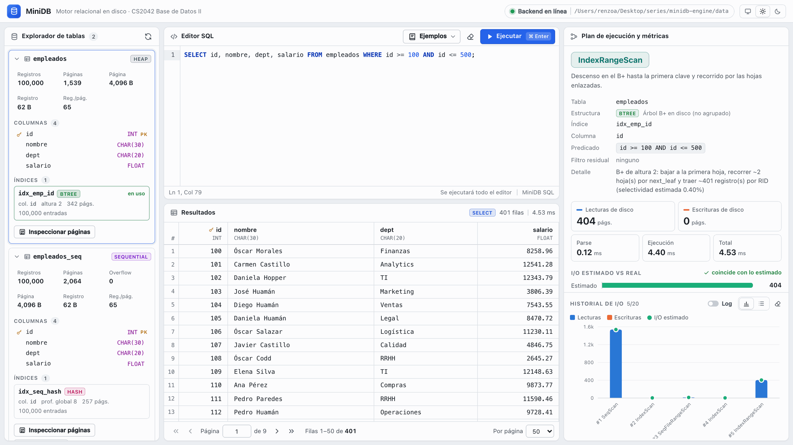

# MiniDB — Motor relacional en disco

Proyecto del curso **Base de Datos II (CS2042) — UTEC 2026-II**, Entregable 1.

MiniDB es un mini gestor de bases de datos relacional construido desde cero que opera
directamente sobre memoria secundaria: todos los datos e índices viven en archivos binarios
paginados que se leen y escriben de a una página completa (`seek` + `read`/`write` con
`struct`), sin motores de bases de datos, ORMs, `pickle` ni JSON para persistir.

| Requisito del enunciado (Entregable 1) | Dónde está |
|---|---|
| Páginas de tamaño fijo con header, RID `⟨page_id, slot⟩` y `DiskCounter` | [`backend/storage/`](backend/storage) |
| Heap File con Free-List | [`backend/files/heap_file.py`](backend/files/heap_file.py) |
| Sequential File (área principal ordenada, overflow encadenado, `reorganize` con fill factor 0.75) | [`backend/files/sequential_file.py`](backend/files/sequential_file.py) |
| Árbol B+ multinivel en disco (split, búsqueda puntual y por rango) | [`backend/indexes/bplus_tree.py`](backend/indexes/bplus_tree.py) |
| Hashing dinámico en disco (Extendible Hashing) | [`backend/indexes/extendible_hash.py`](backend/indexes/extendible_hash.py) |
| Parser SQL propio: `CREATE TABLE`, `INSERT`, `SELECT ... WHERE`, `DELETE`, `CREATE INDEX` | [`backend/sql/`](backend/sql) |
| Planner (SeqScan / IndexScan / IndexRangeScan) con I/O exacto y latencia en ms | [`backend/sql/planner.py`](backend/sql/planner.py) |
| API REST (`POST /api/query`, `GET /api/tables`, `POST /api/tables/reorganize`) | [`backend/api/main.py`](backend/api/main.py), [`docs/api.md`](docs/api.md) |
| Cliente web con 4 paneles (explorador, editor SQL, resultados, plan y métricas) | [`frontend/`](frontend) |
| Datos sintéticos ≥ 100 000 registros y 4 experimentos automatizados | [`data/generate.py`](data/generate.py), [`benchmarks/`](benchmarks) |
| Informe LaTeX y guion del video | [`docs/informe/`](docs/informe), [`docs/guion_video.md`](docs/guion_video.md) |

**Integrantes:** Renzo Acervo, Josué Toribio, _completar_, _completar_.



---

## 1. Levantar todo en un solo paso

Requisito: Docker Desktop (o Docker Engine con Compose v2).

```bash
docker compose up --build
```

| Servicio | URL |
|---|---|
| Cliente web (4 paneles) | <http://localhost:5173> |
| API REST | <http://localhost:8000> — documentación interactiva en <http://localhost:8000/docs> |

Los archivos binarios (`catalog.bin`, `*.heap`, `*.seq`, `*.ovf`, `*.bpt`, `*.hsh`) se guardan en
`./data` (montado como volumen en `MINIDB_DATA_DIR=/app/data`), así que todo sobrevive a un
reinicio de los contenedores.

### Cargar 100 000 registros de prueba

1. Generar el CSV sintético (semilla fija, ids únicos en orden aleatorio):

   ```bash
   docker compose exec backend python data/generate.py --n 100000 --seed 42
   ```

   (o sin Docker: `python3 data/generate.py --n 100000 --seed 42`; solo usa la biblioteca estándar).
   Deja `data/empleados.csv`, que no se versiona.

2. En el cliente web (menú **Ejemplos**) o con `curl`, ejecutar:

   ```sql
   CREATE TABLE empleados (id INT PRIMARY KEY, nombre CHAR(30), dept CHAR(20), salario FLOAT) USING HEAP;
   COPY empleados FROM 'empleados.csv';
   CREATE INDEX idx_emp_id ON empleados (id) USING BTREE;
   SELECT * FROM empleados WHERE id = 101;
   SELECT * FROM empleados WHERE id >= 100 AND id <= 500;
   ```

   ```bash
   curl -s localhost:8000/api/query -H 'Content-Type: application/json' \
        -d '{"sql": "SELECT * FROM empleados WHERE id = 101"}'
   ```

Cada respuesta trae las filas (paginadas), el plan elegido con su costo estimado y los
candidatos que se descartaron, y las métricas exactas: `disk_reads`, `disk_writes`,
`parse_ms`, `exec_ms` y `total_ms`.

## 2. Desarrollo local (sin Docker)

```bash
python3.12 -m venv .venv && source .venv/bin/activate
pip install -r requirements-dev.txt
uvicorn backend.api.main:app --reload            # API en http://localhost:8000

cd frontend && npm install && npm run dev        # cliente en http://localhost:5173 (proxy /api -> :8000)
```

Variables de entorno del backend:

| Variable | Default | Uso |
|---|---|---|
| `MINIDB_DATA_DIR` | `./data` | carpeta del catálogo y de los archivos binarios |
| `MINIDB_PAGE_SIZE` | `4096` | tamaño de página de las tablas nuevas (512–65536, potencia de 2) |
| `MINIDB_PLANNER` | `rules` | `rules` (reglas del enunciado) o `cost` (menor costo estimado) |
| `MINIDB_CORS_ORIGINS` | `http://localhost:5173,...` | orígenes permitidos (`*` = todos) |

## 3. Tests

```bash
pytest            # ~130 tests, ~15 s
```

Cubren round-trip de header/página/registro/RID, **exactitud del contador** (insert en heap
= 1R + 1W, búsqueda en B+ = h lecturas, full scan = P lecturas, hash = 2 lecturas),
invariantes del B+ tras 20 000 inserts aleatorios (hojas ordenadas y enlazadas, misma
profundidad, altura acotada por log_M N), hash con duplicados y splits de directorio,
`reorganize` (conserva registros, vacía el overflow, respeta el fill factor, ordenamiento
externo), persistencia tras cerrar y reabrir, parser (casos válidos y errores con posición),
planner/executor de punta a punta y la API.

## 4. Benchmarks (4 experimentos del enunciado)

```bash
python -m benchmarks.run_all           # corrida completa (~7 min en un portátil)
python -m benchmarks.run_all --quick   # verificación rápida (~30 s)
python -m benchmarks.run_all --only 3  # un experimento
```

Cada experimento corre sobre archivos nuevos (`benchmarks/work/`, no versionado), con semilla
fija, y guarda CSV + PNG en [`benchmarks/results/`](benchmarks/results) (sí versionados):

| Experimento | Script | Resultados |
|---|---|---|
| 1. Inserción masiva, N ∈ {1e3, 1e4, 5e4, 1e5, 2.5e5, 5e5} | `exp1_insert.py` | `exp1_insert.csv`, `exp1_*.png` |
| 2. 1000 búsquedas de igualdad sobre 100 000 registros | `exp2_equality.py` | `exp2_equality.csv`, `exp2_equality.png` |
| 3. Rangos con selectividad 0.1 %, 1 %, 5 %, 10 %, 25 % | `exp3_range.py` | `exp3_range.csv`, `exp3_range.png` |
| 4. Tamaño de página B ∈ {1024, 2048, 4096, 8192} | `exp4_block_size.py` | `exp4_block_size.csv`, `exp4_*.png` |

El análisis contra el costo teórico está en el informe.

## 5. Inspeccionar los archivos binarios

```bash
python -m backend.tools.dump_page data/empleados.heap 0      # página 0: metadatos del archivo
python -m backend.tools.dump_page data/empleados.heap 1      # header + bitmap + registros + hexdump
python -m backend.tools.dump_page data/empleados_id.bpt 1    # nodo del B+ (claves y RIDs)
python -m backend.tools.dump_page data/empleados.seq --all   # header de todas las páginas
```

(Dentro de Docker: `docker compose exec backend python -m backend.tools.dump_page data/empleados.heap 1`.)
El cliente web tiene el mismo inspector (botón **Inspeccionar páginas** de cada tabla), que usa
`GET /api/tables/{tabla}/pages/{page_id}?file=...`.

## 6. SQL soportado

```text
CREATE TABLE t (col TYPE [PRIMARY KEY], ...) [USING HEAP | SEQUENTIAL];
CREATE INDEX nombre ON t (col) [USING BTREE | HASH];
INSERT INTO t VALUES (lit, ...), (lit, ...);
SELECT * | col, ... FROM t [WHERE cond];
DELETE FROM t [WHERE cond];
DROP TABLE t;   DROP INDEX nombre;
COPY t FROM 'archivo.csv';          -- carga masiva desde MINIDB_DATA_DIR
EXPLAIN SELECT ... | EXPLAIN DELETE ...

cond := pred {AND pred}
pred := col op lit | lit op col | col BETWEEN lit AND lit      op := = | != | <> | < | <= | > | >=
TYPE := INT | INTEGER | FLOAT | CHAR(n) | VARCHAR(n)
```

Palabras clave case-insensitive, strings entre comillas simples (`''` escapa una comilla),
comentarios `--` y `/* */`, `;` opcional. Los errores de sintaxis devuelven HTTP 400 con el
mensaje y la línea/columna del token.

## 7. Diseño en una página

```text
Cliente web (React + CodeMirror + Recharts)
        │  HTTP/JSON
API REST (FastAPI) ── Database: catálogo + tablas abiertas + DiskCounter por sentencia
        │
Lexer → Parser (descenso recursivo) → Planner (costos) → Executor
        │
Table ── HeapFile | SequentialFile (+ overflow)      Índices: BPlusTree | ExtendibleHash
        │
DiskManager (seek + read/write de páginas completas, conteo exacto de I/O)
        │
Archivos binarios paginados en MINIDB_DATA_DIR
```

- **Página**: header común de 24 bytes `'<IBBHHiiixx'` (`page_id`, `page_type`, `flags`,
  `record_count`, `free_space_offset`, `next_page_id`, `prev_page_id`, `aux_page_id`). La
  página 0 de cada archivo guarda metadatos (magic `MDB1`, versión, tipo, `page_size`, ...).
- **Registros** de longitud fija con bitmap de presencia: `[header 24][bitmap][cap × registro]`.
  `empleados` ocupa 62 B → 16 / 32 / 65 / 131 registros por página para B = 1024…8192.
- **Heap**: free-list de páginas con espacio (cabeza en la página 0). Insert 1R + 1W, full scan
  P lecturas, borrado lógico.
- **Sequential**: páginas principales ordenadas por rango de PK (búsqueda binaria ~log2 M),
  cadena de overflow por página (`aux_page_id`), `reorganize` en streaming con fill factor 0.75,
  automático cuando el overflow supera el 10 % de las páginas principales.
- **B+**: internos `⟨P0,K1,P1,…,Km,Pm⟩` (508 claves con B = 4096 e INT), hojas `⟨key,RID⟩`
  (407) con `next_leaf`/`prev_leaf`; split al 50 %, búsqueda en h lecturas, rango por hojas.
- **Extendible hashing**: directorio de 2^gd punteros en páginas propias, buckets con
  profundidad local, `zlib.crc32` como función hash, búsqueda en 2 lecturas.
- **Planner**: igualdad con índice → `IndexScan`; rango con B+ → `IndexRangeScan`; tabla
  SEQUENTIAL con predicado sobre la PK → `BinarySearch` / `SeqFileRangeScan`; si no, `SeqScan`.
  Cada plan informa su costo estimado de I/O y el real medido.

### Decisiones documentadas

- **Sin buffer pool**: cada acceso es una transferencia real, así las métricas coinciden con la
  teoría. La página 0 se lee al abrir el archivo y queda en memoria; al final de cada sentencia
  se escribe solo si cambió su estructura (cabeza de la free-list, raíz, altura, directorio), y
  las estadísticas (nº de registros) se persisten con esa escritura o al cerrar.
- **Unicidad de la PK**: en SEQUENTIAL la valida el propio archivo (búsqueda binaria + overflow);
  en HEAP se valida con el índice único sobre la PK si existe (validarla con full scan haría
  O(N²) el Experimento 1).
- **Sin transacciones**: un `INSERT` de varias filas se aplica hasta la fila que falla.
- **Borrados** lógicos (bitmap). El B+ no fusiona nodos y el hash no fusiona buckets.
- En el área principal del Sequential los slots borrados no se reutilizan hasta reorganizar:
  el slot 0 conserva la clave frontera que guía la búsqueda binaria.

## 8. Estructura del repositorio

```text
backend/
  storage/    disk_manager.py, page.py, record.py, rid.py, catalog.py
  files/      heap_file.py, sequential_file.py
  indexes/    bplus_tree.py, extendible_hash.py
  sql/        lexer.py, parser.py, ast.py, predicates.py, planner.py, executor.py
  api/        main.py (FastAPI)
  tools/      dump_page.py
  table.py, database.py, config.py
tests/        un test_*.py por módulo
frontend/     cliente React + TypeScript (Vite)
data/         generate.py (los .csv y binarios no se versionan)
benchmarks/   exp1_insert.py … exp4_block_size.py, run_all.py, results/ (CSV + PNG)
docs/         Proyecto_Enunciado.pdf, api.md, informe/ (LaTeX), guion_video.md
```
